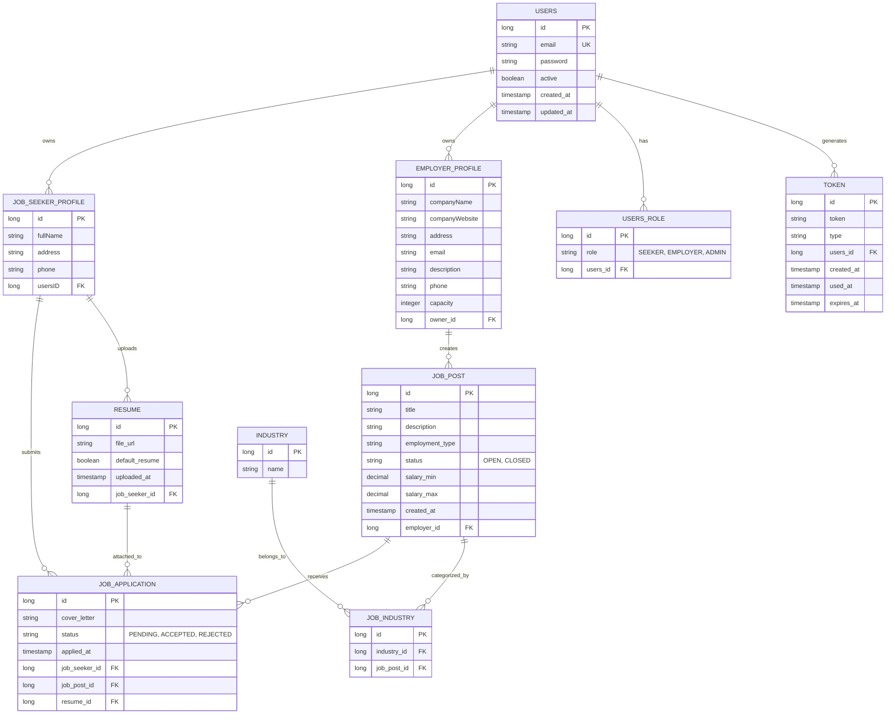

# 💼 Job Portal Server

A comprehensive job portal backend application built with Spring Boot, enabling job seekers and employers to connect seamlessly.

---

## 🛠️ Tech Stack


---

## 📊 Database Schema



---

## 🚀 How to Run

### Prerequisites
- Docker and Docker Compose installed on your machine
- Java 17+ (if running without Docker)
- PostgreSQL 16+ (if running without Docker)

### Option 1: Using Docker Compose (Recommended)

1. **Clone the repository**
   ```bash
   cd JobPortal
   ```

2. **Build and start services**
   ```bash
   docker-compose up --build
   ```

   This will start:
   - PostgreSQL database on `localhost:5432`
   - Adminer (database UI) on `localhost:5050`
   - Spring Boot application on `localhost:8080`

3. **Verify services are running**
   - Spring Boot API: http://localhost:8080
   - Adminer: http://localhost:5050
   - Database credentials:
     - Username: `admin`
     - Password: `admin`
     - Database: `mydb`

4. **Stop services**
   ```bash
   docker-compose down
   ```

### Option 2: Running Locally

1. **Start PostgreSQL Database**
   ```bash
   # Ensure PostgreSQL is running on localhost:5432
   # Create database 'mydb' with user 'admin' and password 'admin'
   ```

2. **Build the project**
   ```bash
   ./gradlew clean build
   ```

3. **Run the Spring Boot application**
   ```bash
   ./gradlew bootRun
   ```

   The application will start on `http://localhost:8080`

### Database Configuration
- **URL**: `jdbc:postgresql://localhost:5432/mydb`
- **Username**: `admin`
- **Password**: `admin`
- **DDL Strategy**: `update` (automatically creates/updates tables)

---

## 📚 API Modules

- **Authentication** - User registration, login, token management
- **User Management** - User profile and role management
- **Job Management** - Job post creation, searching, and management
- **Applications** - Job application submission and tracking
- **Resume** - Resume upload and management

---

## 🔧 Development Notes

- **ORM**: Hibernate via Spring Data JPA
- **Validation**: Jakarta validation annotations
- **Dependency Injection**: Spring Framework
- **Database Indexes**: Optimized for common query patterns
- **Timezone**: Using LocalDateTime for all timestamps

---

## 📝 License

This project is part of the Cloudian Job Portal initiative 