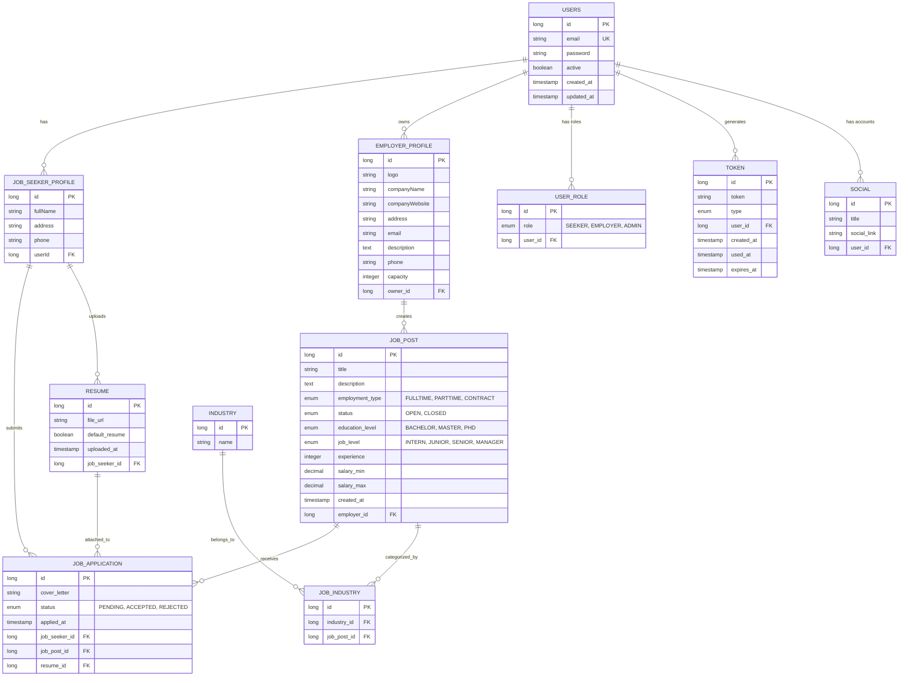

# 💼 Job Portal Server

> A comprehensive job portal backend application built with Spring Boot, enabling job seekers and employers to connect seamlessly.

---

## 🛠️ Tech Stack

<div align="center">


</div>

---

## 📊 Database Schema



---

## 🚀 How to Run

### Prerequisites

- Docker and Docker Compose installed on your machine
- Java 17+ (if running without Docker)
- PostgreSQL 16+ (if running without Docker)
- IntelliJ IDEA (or VS Code with Java extensions)

### 1. Clone the repository

```bash
cd JobPortal
```

### 2. Build and start services

Check the services in `docker-compose.yaml`

```bash
docker-compose up -d postgres adminer 
```

**⚠️ Notice**: Don't run the app service in `docker-compose.yaml`

This will start:
- PostgreSQL database on `localhost:5432`
- Adminer (database UI) on `localhost:5050`
- Spring Boot application on `localhost:8080`

### 3. Verify services are running

- **Spring Boot API**: http://localhost:8080
- **Adminer**: http://localhost:5050
- **Database Credentials**: (http://localhost:5432)
  - Username: `admin`
  - Password: `admin`
  - Database: `mydb`

- **Account for login Adminer** (http://localhost:5050) 
  - Database: PostgresSQL 
  - Server: postgres 
  - username: admin 
  - password: admin 
  - database: mydb 
### 4. Stop services (if needed)

```bash
docker-compose down
```

**⚠️ Notice!**: Don't run the app in docker-compose automatically.

### 5. Run the Spring Boot application

- Add environment variables from `.env.example` to Application Configuration
- Update `application.properties` file: change `spring.jpa.hibernate.ddl-auto=` to `create` (if you're creating the database for the first time)
- Click the **Run** button on IntelliJ IDEA to start the application
- The application will start on `http://localhost:8080`

### Database Configuration

| Property | Value |
|----------|-------|
| **URL** | `jdbc:postgresql://localhost:5432/mydb` |
| **Username** | `admin` |
| **Password** | `admin` |
| **DDL Strategy** | `update` |

---

## 📚 API Modules

- **Authentication** - User registration, login, token management
- **User Management** - User profile and role management
- **Job Management** - Job post creation, searching, and management
- **Applications** - Job application submission and tracking
- **Resume** - Resume upload and management

---

## 🔧 Development Notes

- **ORM**: Hibernate via Spring Data JPA
- **Validation**: Jakarta validation annotations
- **Dependency Injection**: Spring Framework
- **Database Indexes**: Optimized for common query patterns
- **Timezone**: Using LocalDateTime for all timestamps

---

## 📝 License

This project is part of the Cloudian Job Portal initiative

<div align="center">

**Made with Cloudian 💙 with love**

</div>

